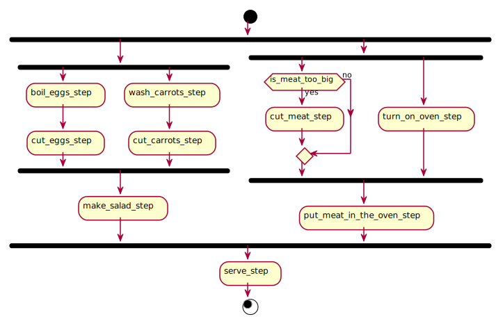

# Go-Pipeline

Go module for building, executing and representing pipelines. For more information visit the [GoDoc API](https://godoc.org/github.com/saantiaguilera/go-pipeline)

### Example

_The following code and representation can be found under the [examples directory](examples/cook_example/) if you want to play with it._

Imagine we are 3 persons making a dish. We have to:
1. Put the eggs to boil. When done, cut them.
2. Wash the carrots. Cut them.
3. Start the oven. If the meat is too big, cut it. Put the meat in the oven.
4. Make a salad with the cut eggs and carrots
5. Serve

The following can be represented as such (using the `pipeline.DrawableDiagram` API)



This flow can be built and executed as such:
```go
// Complete stage. Its sequential because we can't serve
// before all the others are done. 
graph := pipeline.CreateSequentialGroup(
    // Concurrent stage, given we are 3, we can do the salad / meat separately
    pipeline.CreateConcurrentGroup(
        // This will be the salad flow. It can be done concurrently with the meat
        pipeline.CreateSequentialGroup( 
            // Eggs and carrots can be operated concurrently too
            pipeline.CreateConcurrentGroup(
                // Sequential stage for the eggs flow
                pipeline.CreateSequentialStage(
                    // Use a mean of communication. Channels could be one.
                    CreateBoilEggsStep(eggsChan),
                    CreateCutEggsStep(eggsChan),
                ),
                // Another sequential stage for the carrots (eggs and carrots will be concurrent though!)
                pipeline.CreateSequentialStage(
                    // Use a mean of communication. Channels could be one.
                    CreateWashCarrotsStep(carrotsChan),
                    CreateCutCarrotsStep(carrotsChan),
                ),
            ),
            // This is sequential. When carrots and eggs are done, this will run
            pipeline.CreateSequentialStage(
                CreateMakeSaladStep(carrotsChan, eggsChan, saladChan),
            ),
        ),
        // Another sequential stage for the meat (concurrently with salad)
        pipeline.CreateSequentialGroup(
            // If we end up cutting the meat, we can optimize it with the oven operation
            pipeline.CreateConcurrentGroup(
                // Conditional stage, the meat might be too big
                pipeline.CreateConditionalStage(
                    func() bool {
                        return IsMeatTooBigForTheOven()
                    },
                    // True:
                    CreateCutMeatStep(meatChan),
                    // False:
                    nil,
                ),
                pipeline.CreateSequentialStage(
                    CreateTurnOvenOnStep(),
                ),
            ),
            pipeline.CreateSequentialStage(
                CreatePutMeatInOvenStep(meatChan),
            ),
        ),
    ),
    // When everything is done. Serve
    pipeline.CreateSequentialStage(
        CreateServeStep(meatChan, saladChan),
    ),
)

pipe := pipeline.CreatePipeline(CreateYourExecutor())
pipe.Run(graph)
```